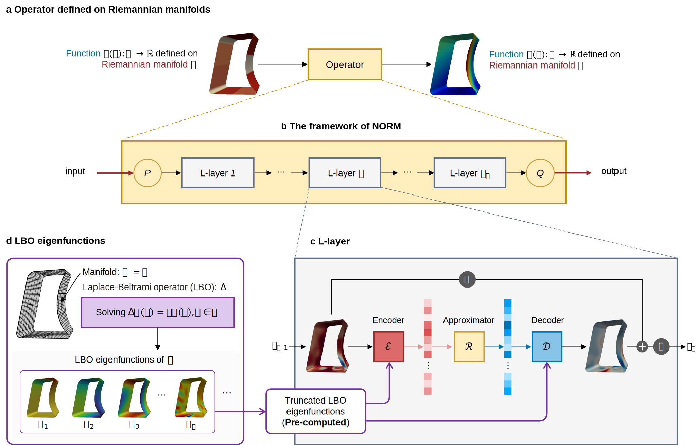

# Laplace neural operator for complex geometries


This repository contains code accompanying our paper ["Laplace neural operator for complex geometries"](https://arxiv.org/abs/2302.08166). 

## Dependencies & packages
Dependencies:
* Python (tested on 3.8.11)
* PyTorch (tested on 1.8.0)

Additionally, we need an open-source Python package Lapy (https://github.com/Deep-MI/LaPy/tree/main) for differential geometry on triangle and tetrahedra meshes, which is used to calculate LBO basis. If you fail to install it, try to add the `lapy` folder included in our source code into your path.

## Data
The datasets of Case0-Case2 can be found in `datasets` folder. You can download the dataset(s) of Case3 and Case4 from [here](https://drive.google.com/drive/folders/1FEat-Hn8rpvR33JDxPF6UROXee1626_1?usp=sharing). 

```
Case0-DarcyFlow.mat
├── Input: `c_field`(1200*2290)
└── Output: `u_field`(1200*2290)
---------------------------------------------
Case1-Turbulence.mat
├── Input: `Input`(400*2673)
└── Output: `Output`(400*2673)
---------------------------------------------
Case2-HeatTransfer.mat
├── Input: `input`(300*186)
└── Output: `output`(300*7199)
---------------------------------------------
Case3-Composites.mat
├── Input: `T_field`(1200*8232)
└── Output: `D_field`(1200*8232)
---------------------------------------------
Case4-BloodFlow.mat
├── Input: `BC_time`(500*121*6)
└── Output: `velocity_x`(500*1656*121),`velocity_y`,`velocity_z`
```

## Usage

For all cases, you can directly run the codes by executing `main.py` to quickly obtain the results. Note that each experiment is repeated five times, the same setup as in our paper. Each case also retains the setting of hyperparameters in the paper.
```
python main.py 
```
Additionally, we provide the `Calculate_LBO_basis.py` in `datasets` folder to calculate the LBO basis for Case2, Case3 and Case4. The calculation of Case0 and Case1 are embedded in the corresponding `main.py`.


## Results
### Case0, Case1 and Case2

---------------------------------------------------
### Case3

----------------------------------------------------
### Case4
https://github.com/qingluM/NORM/assets/57898734/51882e44-0311-4fb4-b6eb-5949a9baf90a


## Publication
If you found this repository useful, please consider citing our paper:
```
@article{chen2023laplace,
  title={Laplace neural operator for complex geometries},
  author={Chen, Gengxiang and Liu, Xu and Li, Yingguang and Meng, Qinglu and Chen, Lu},
  journal={arXiv preprint arXiv:2302.08166},
  year={2023}
}
```
